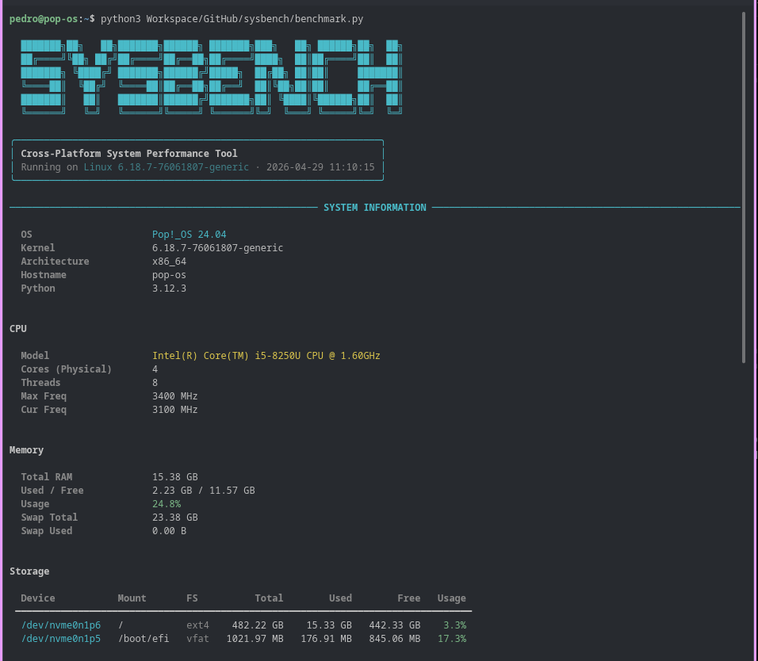
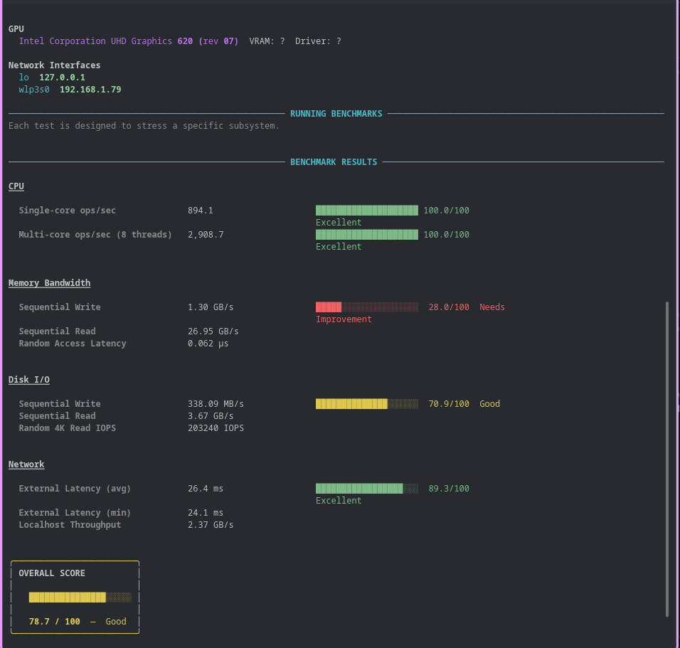

# SysBench

A comprehensive system performance benchmarking tool written in Python to validate and evaluate the performance of your machine across multiple dimensions.

## Overview

**SysBench** is a cross-platform performance evaluation tool that provides detailed insights into your system's capabilities. It performs comprehensive benchmarks on CPU, memory, disk, and network performance while gathering detailed system information.

### Key Features

- **System Information**: Detailed hardware and OS detection (CPU cores, RAM, disk capacity, network interfaces)
- **CPU Benchmarking**: Multi-threaded CPU performance evaluation with scoring
- **Memory Benchmarking**: RAM read/write performance testing and analysis
- **Disk Benchmarking**: Sequential and random I/O performance measurement
- **Network Benchmarking**: Network latency and throughput testing
- **Multi-Format Reports**: Results exported as JSON and HTML for analysis and sharing
- **Cross-Platform**: Supports Linux, macOS, and Windows
- **Rich Terminal Output**: Beautiful, colorized terminal interface for real-time feedback

## Requirements

- Python 3.7+
- `psutil` - system and process utilities
- `rich` - rich text and beautiful formatting in the terminal

Install dependencies:
```bash
pip install psutil rich
```

## Usage

Run the benchmarking tool:
```bash
python3 benchmark.py
```

## Results

Command output




The tool generates two output formats for easy analysis and sharing:

- **[sysbench_result.json](sysbench_result.json)** - Machine-readable JSON format containing all benchmark data and system metrics
- **[sysbench_result.html](sysbench_result.html)** - Interactive HTML report for visual analysis and sharing

## Project Structure

- `benchmark.py` - Main benchmarking tool
- `sysbench_result.json` - Example benchmark results in JSON format
- `sysbench_result.html` - Example benchmark results in HTML format
